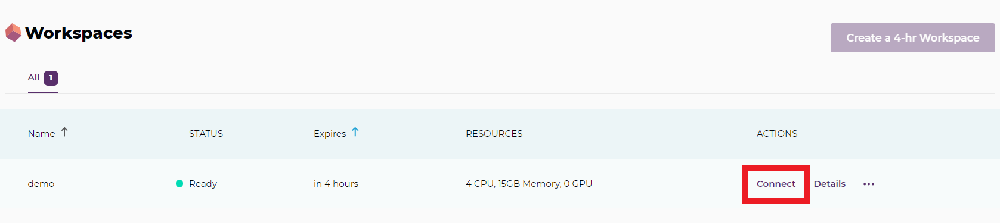

# Fuente de los datos

Para los datos de las playas estos pueden tomarse del [ATLAS digital 2014](https://repositoriotec.tec.ac.cr/handle/2238/6749), se deben descargar todos los archivos y obtener la capa especifica de playas, la cual viene con coordenadas geográficas CRTM05.

Los datos de los segmentos censales se deben solicitar al Instituto Nacional de Estadística y Censos de Costa Rica.

# Llevar imagen a container registry 

**Si ya la imagen está ahí no es necesario hacer todos estos pasos y podemos pasar al apartado de Ejecutar Pachyderm**

1. Ponemos el service account de demos-ixpantia en la carpeta `datos` de este repositorio, este service account vamos asumir que se llama `gcs_demos_ixpantia_key.json`.

2. Nos movemos a la carpeta `datos` de este repositorio, nos autenticamos por medio de ese service account en google usando :

```
gcloud auth activate-service-account --key-file=gcs_demos_ixpantia_key.json
```

3. Hacemos el built del Dockerfile en la carpeta raiz de este repositorio con:

```
docker build -t gcr.io/demos-ixpantia/espacial .
```

4. Dejamos que docker se autentifique con google para que pueda acceder al container registry. Para ello hacemos:

```
gcloud auth configure-docker
```

5. Hacemos el push al container registry de google con:

```
docker push gcr.io/demos-ixpantia/espacial
```

# Ejecutar Pachyderm

1. Vamos a Pachyderm Hub y creamos un cluster.

2. Lo primero que tenemos que hacer es seguir las instrucciones en la terminal tal cual aparecen en la opción de `connect`. La opción `connect` se muestra en la siguiente imagen:



3. Una vez configurado, podemos usar `pachctl version` y validar que el cluster está funcionando con `pachd`.

4. Vamos a trabajar en la carpeta raíz de este repositorio, así que en la terminal nos dirigimos a esta carpeta.

5. Creamos el repositorio de entrada donde van a estar los shapes. En este caso se va a llamar `shapes`. Lo hacemos con:

```
pachctl create repo shapes_sp
```

Podemos verificar que se creó correctamente con `pachtl list repo`.

6. Para traer los datos desde un bucket externo, en GCP (Google cloud Platform) para este caso, se necesita dar los permisos a ese bucket del service account que asigna automáticament Pachyderm, o bien hacerlos públicos como es este caso.

```
pachctl put file shapes_sp@master -r -f gs://demo_espacial/shapes/
```

Los permisos que debemos dar al service account de Pachyderm, al menos en GCP, son `Storage Object Viewer` en caso de que queramos que los datos no sean públicos del todo.

7. Para poder acceder a la imagen que está ahora en el container registry la forma más sencilla que encontramos es hacer público el container registry. Dado que solo tenemos imagenes para esta demo, decidimos hacerlo así por el momento. Una vez que está público entonces Pachyderm puede acceder a esa imagen sin ningún problema.

8. Ponemos a trabajar el primer pipeline con:

```
pachctl create pipeline -f pipeline_separa.json
```

9. Para ver los logs de cada corrida podemos usar `pachctl logs --pipeline=separa_shape`, y además podemos ver el avance del trabajo usando `pachctl inspect job <job_id>` en donde el `<job_id>` podemos obtenerlo de `pachctl list job`.

10. Una vez que termina, el archivo `playas.rds` se usará para cada uno de los segmentos, es decir se debe usar en cada datum. La forma de poder hacer esto es mandando el archivo `playas.rds` a un repositorio nuevo y hacer un `cross` en los repositorios de entrada (esto me permite usar más de un repositorio de entrada). Pachyderm combina cada unidad de un repositorio con los del otro de manera que en este caso se tendrá disponible las playas en cada datum de segmento. Para ello vamos a crear un nuevo repositorio llamado `playas` y llevamos aquí el archivo `playas.rds`

```
pachctl create repo playas
pachctl get file separa_shape@master:/shapes_segmentos/playas/playas.rds -o playas.rds
pachctl put file playas@master -f playas.rds
rm playas.rds
```
10. Hecho esto poner a correr el siguiente pipeline. Lo hacemos con:

```
pachctl create pipeline -f pipeline_distancias.json
```

Para ver el proceso podemos hacer `pachctl inspect job <id_job>` en donde se puede obtener el `<id_job>` haciendo `pachctl list job` y se copia el `ID` del job que queremos consultar.

11. Por último se debe correr el pipeline que une todos los archivos en uno solo. Esto lo hacemos con:

```
pachctl create pipeline -f pipeline_une.json
```

12. Cuando termina de ejecutarse el pipeline anterior, para sacar el archivo final del repositorio de salida `une_segmentos`, podemos hacer:

```
pachctl get file une_segmentos@master:/segmentos_playas.rds -o <path_al_que_queremos_copiar_archivo/segmentos_playas.rds>
```
